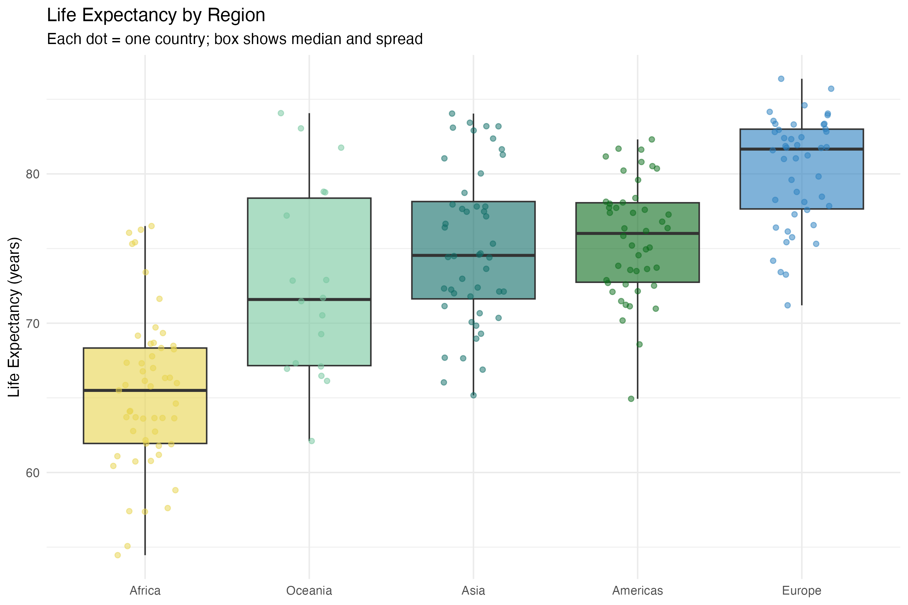
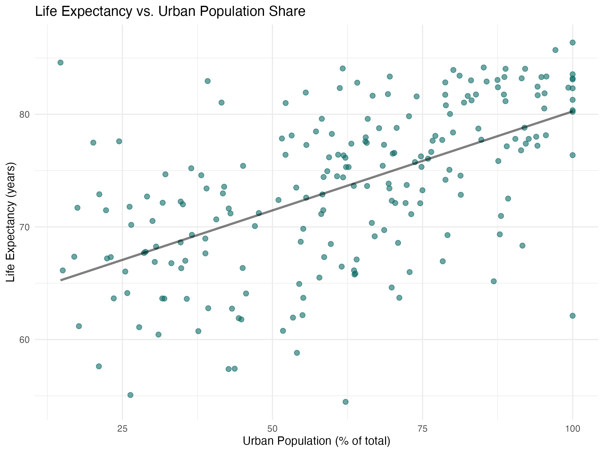
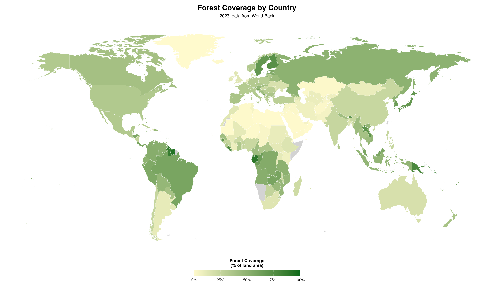

# Data Brief: Life Expectancy, Urbanization, and Forest Cover
**Ali Hunter | EIL Summer 2026 | May 2026**

---

This brief examines how life expectancy varies across countries and how it relates to two environmental and demographic indicators — urbanization and forest cover — using 2023 World Bank data. The figures below summarize the key patterns across approximately 180 countries.

---

## Indicator 1: Life Expectancy by Region

Life expectancy varies sharply by region. Europe has the highest median and the tightest distribution, meaning most European countries cluster near the top. Africa has the lowest median and the widest spread, reflecting large within-continent variation. Asia and the Americas sit in the middle, each with notable outliers at both ends.

---

## Indicator 2: Urbanization and Life Expectancy

More urbanized countries tend to have longer life expectancies. The upward trend is consistent but not perfectly linear — several highly urbanized countries still have relatively low life expectancy, suggesting urbanization alone does not determine health outcomes. The pattern likely reflects the broader economic development that tends to accompany urbanization.

---

## Indicator 3: Forest Cover Across the World

Forest cover is highly uneven across the globe. Central Africa, South and Southeast Asia, and the Amazon basin in South America are the most densely forested regions. The Middle East, North Africa, and Central Asia have almost no forest cover. This geographic variation reflects both climate and land use, and is largely independent of income level.

---

## Sources

| Variable | Indicator Code | Source |
|----------|---------------|--------|
| Life expectancy at birth (years) | `SP.DYN.LE00.IN` | World Bank WDI |
| Forest area (% of land area) | `AG.LND.FRST.ZS` | World Bank WDI |
| Urban population (% of total) | `SP.URB.TOTL.IN.ZS` | World Bank WDI |

All data are from the World Bank World Development Indicators (2023) and are publicly available at [data.worldbank.org](https://data.worldbank.org) under the Creative Commons Attribution 4.0 International License.
